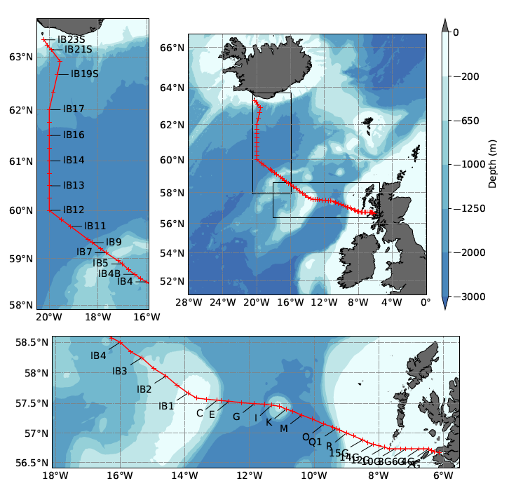
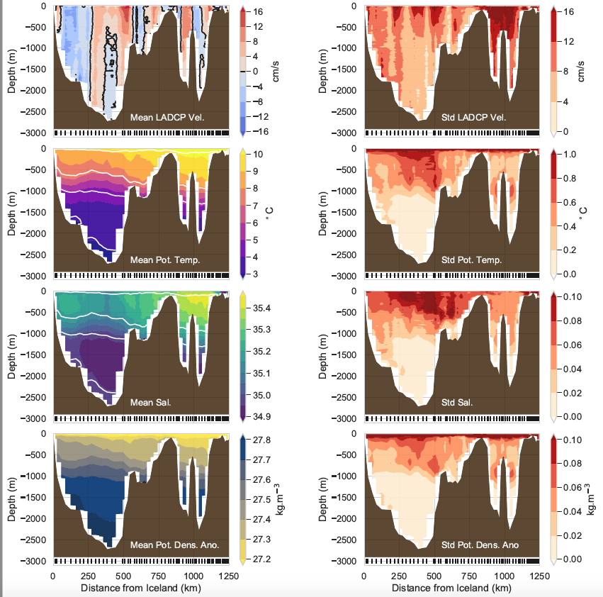
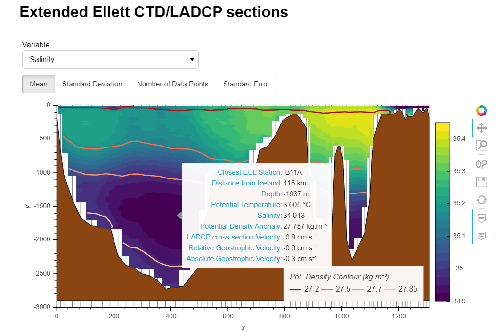

Analysis EEL data
==============================
[](https://mybinder.org/v2/gh/lhoupert/analysis_eel_data/master?filepath=notebooks)
[](https://travis-ci.com/lhoupert/analysis_eel_data)
[](https://codecov.io/gh/lhoupert/analysis_eel_data)
[](https://opensource.org/licenses/MIT)

A repository associated with the [Extended Ellett Line (EEL)](https://projects.noc.ac.uk/ExtendedEllettLine/)  oceanographic dataset  It mostly contains [python scripts](https://mybinder.org/v2/gh/lhoupert/analysis_eel_data/master?filepath=notebooks)  used to analyse and visualise these oceanographic data.


This repository is a work in progress and should be updated regularly. This repo can also be run on [binder](https://mybinder.org/v2/gh/lhoupert/analysis_eel_data/master/notebooks).

### Requirements to run the notebooks locally
 - [Conda package manager](https://conda.io/en/latest/)


### Quickstart


- Clone or download the repository

```
git clone https://github.com/lhoupert/analysis_eel_data.git
```

- Create and activate the Conda environment *analysis\_eel\_data* containing the relevant libraries (the creation of the environment can take a few minutes)

```
cd analysis_eel_data
conda env create -f environment.yml
conda activate analysis_eel_data
```

- Run the Jupyter notebooks available

```
cd notebooks
jupyter-lab
```

<br/>

### To run it with docker

1. Make sure you have [docker](https://docs.docker.com/get-docker/) installed.

2. Open a terminal and from the root directory of the repository run: 
    ```shell
    docker-compose up --build
    ```

3. Open a web-browser and go to: http://127.0.0.1:8886 then enter the token `analysis_eel_data`.

4. To stop the docker you can just do `CTRL + C` in the terminal. 

5. Once the container has been built you can start it with 
    ```
    docker-compose up
    ```
    or 
    ```
    docker-compose up -d
    ``` 
    and stop it with: 
    ```
    docker-compose down
    ```


## List of current notebooks available (work in progress)


### 1. Maps

#### 1.1 Bathymetry map of the North Atlantic Ocean using *cartopy* and *matplotlib* axes functions
The notebook [01-lh-Plot-map-EEL-data.ipynb](https://nbviewer.jupyter.org/github/lhoupert/analysis_eel_data/blob/master/notebooks/01-lh-Plot-map-EEL-data.ipynb) plot the bathymetry of the North Atlantic Ocean with two regional zoom and with the label of the hydrographic stations



<br/>

#### 1.2 Bathymetry map with mean current vector and mean current ellipse overlaid using *cartopy* and *xarray*

*work in progress*

<br/>

### 2. Data exploration and visualisation

#### 2.1 Exploration of EEL dataset and contour plots of mean quantities
The notebook [02-lh-Explore-EEL-meanfield.ipynb.ipynb](https://nbviewer.jupyter.org/github/lhoupert/analysis_eel_data/blob/master/notebooks/02-lh-Explore-EEL-meanfield.ipynb) is used to explore the EEL dataset. It also generates summary figures of the mean and standard deviation of the velocity, temperature, salinity and density along the EEL section (see example below).

*Note: I used [xarray](http://xarray.pydata.org/en/stable/) to handle multi-dimensional datasets.*



<br/>

#### 2.2 Interactive display of contourf section

The notebook [holoview/02-lh-holoview_2_gridded_section.ipynb](notebooks/holoview/02-lh-holoview_2_gridded_section.ipynb) shows how to use [HoloViews](https://holoviews.org) and
[Panel](https://panel.holoviz.org) to display interactive section of the EEL data.



--------

<p><small>Project based on the <a target="_blank" href="https://github.com/jbusecke/cookiecutter-science-project">cookiecutter science project template</a>.</small></p>
